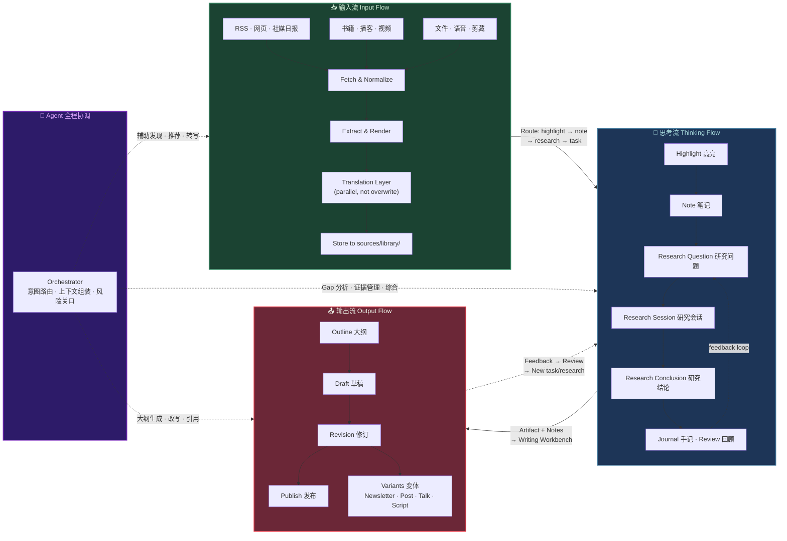
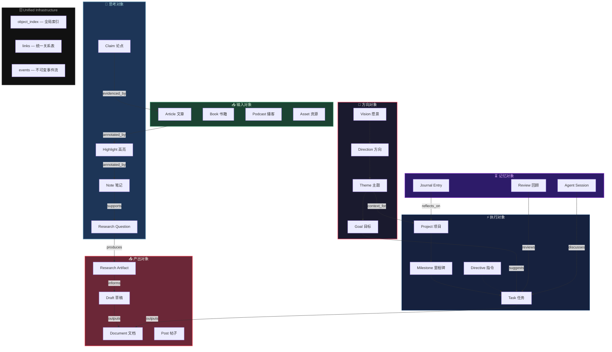
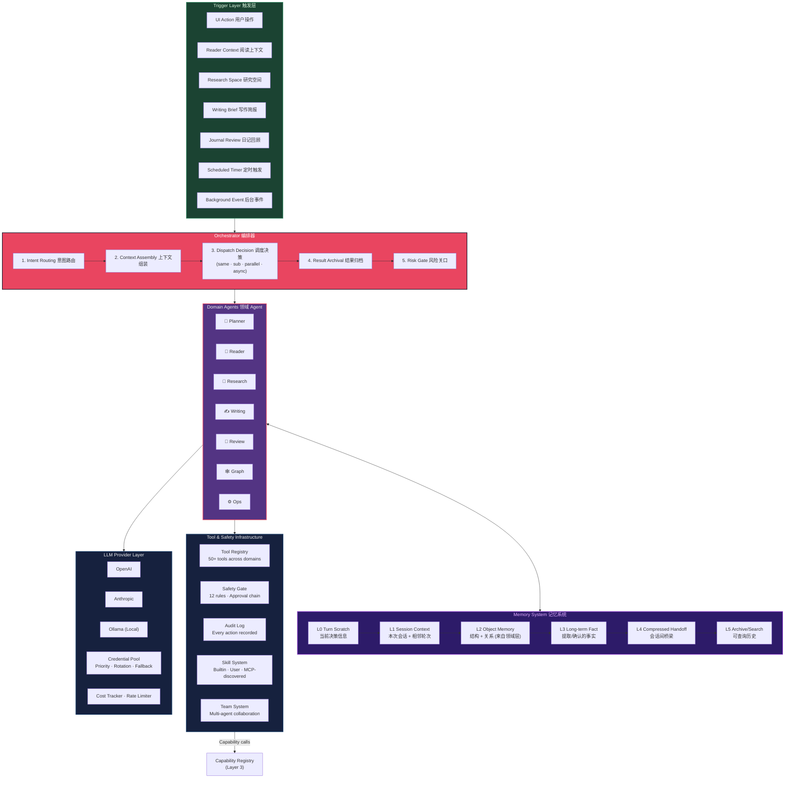
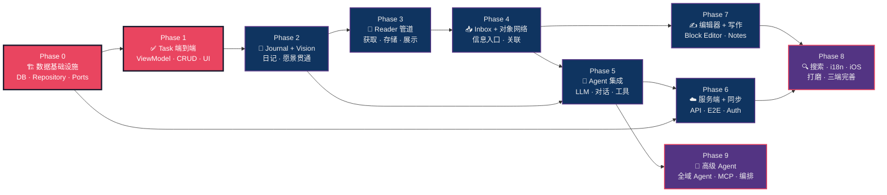

# Orbit 系统架构蓝图

> **开发前必读** — 本图描绘 Orbit 的完整架构愿景。
> 所有开发工作应先理解本图中的层次与数据流，再动手编码。

## 总体架构：五层 + 三端 + 七 Agent

```mermaid
graph TB
  %% ============================================================
  %% COLOR THEME
  %% ============================================================
  classDef expLayer fill:#1a1a2e,stroke:#e94560,color:#eee,stroke-width:2px
  classDef agentLayer fill:#16213e,stroke:#0f3460,color:#eee,stroke-width:2px
  classDef capLayer fill:#0f3460,stroke:#533483,color:#eee,stroke-width:2px
  classDef dataLayer fill:#533483,stroke:#e94560,color:#eee,stroke-width:2px
  classDef storageLayer fill:#2c003e,stroke:#e94560,color:#eee,stroke-width:2px
  classDef serverBox fill:#1b1b2f,stroke:#e43f5a,color:#eee,stroke-width:2px
  classDef flowArrow stroke:#e94560,stroke-width:2px
  classDef dimBox fill:#111,stroke:#444,color:#999

  %% ============================================================
  %% LAYER 1 — EXPERIENCE LAYER  体验层
  %% ============================================================
  subgraph EXP["🖥️  L1 · Experience Layer — 体验层"]
    direction LR
    subgraph Desktop["Desktop (Electron)"]
      direction TB
      D_Main["main process<br/>IPC · LLM Proxy · FS"]
      D_Renderer["renderer<br/>React DOM · HeroUI v3"]
      D_Main --- D_Renderer
    end
    subgraph Web["Web (Browser)"]
      direction TB
      W_Entry["SPA entry<br/>React DOM · HeroUI v3"]
      W_Worker["Web Worker<br/>wa-sqlite · OPFS"]
      W_Entry --- W_Worker
    end
    subgraph iOS["iOS (React Native)"]
      direction TB
      I_Native["Expo Router<br/>RN Components"]
      I_SQLite["expo-sqlite"]
      I_Native --- I_SQLite
    end

    subgraph SharedUI["Shared UI Packages"]
      UI_Tokens["ui-tokens<br/>Design Tokens · OKLCH"]
      UI_Dom["ui-dom<br/>DOM Theme"]
      UI_Native["ui-native<br/>Native Theme"]
      Conv_UI["conversation-ui<br/>Streaming · Messages · Panels"]
      Editor["editor-dom<br/>TipTap · Block Schema · Markdown"]
      I18N["i18n<br/>zh-CN · en-US · zh-TW"]
    end
  end
  EXP:::expLayer

  %% ============================================================
  %% LAYER 2 — AGENT RUNTIME LAYER  Agent 运行时层
  %% ============================================================
  subgraph AGENT["🤖  L2 · Agent Runtime Layer — Agent 运行时层"]
    direction LR
    subgraph Orchestrator["Orchestrator 编排器"]
      Intent["Intent Router<br/>意图路由"]
      Context["Context Assembler<br/>上下文组装"]
      Dispatch["Dispatch / Risk Gate<br/>调度 · 风险关口"]
    end

    subgraph DomainAgents["Seven Domain Agents"]
      A_Planner["🎯 Planner<br/>Vision · Task · Today<br/>Focus · Review"]
      A_Reader["📖 Reader<br/>Article · Book · Podcast<br/>Transcript · Highlight"]
      A_Research["🔬 Research<br/>Question · Source Set<br/>Claim · Gap · Artifact"]
      A_Writing["✍️ Writing<br/>Draft · Document · Post<br/>Outline · Variant"]
      A_Review["📓 Review<br/>Journal · Timeline<br/>Daily · Weekly Summary"]
      A_Graph["🕸️ Graph<br/>Object Index · Links<br/>Backlinks · Dedup"]
      A_Ops["⚙️ Ops<br/>Async Job · Approval<br/>Notification · Connector"]
    end

    subgraph AgentInfra["Agent Infrastructure"]
      LLM["LLM Providers<br/>OpenAI · Anthropic · Ollama"]
      Memory["Multi-Layer Memory<br/>L0 Turn → L5 Archive"]
      Session["Session Manager<br/>Lineage · Compression"]
      Safety["Safety Gate<br/>Approval · Audit"]
      Tools["Tool Registry<br/>50+ Domain & General Tools"]
      Skills["Skill System<br/>Builtin · User · MCP"]
      Cost["Cost Tracker<br/>Rate Limiter"]
      Observe["Observability<br/>Trace · Metrics · Log"]
    end
  end
  AGENT:::agentLayer

  %% ============================================================
  %% LAYER 3 — CAPABILITY LAYER  能力层
  %% ============================================================
  subgraph CAP["⚡  L3 · Capability Layer — 能力层 (MCP)"]
    direction LR
    subgraph CapDomains["Eight Capability Domains"]
      C_WQ["Workspace Query<br/>项目摘要 · 对象详情<br/>关系图谱 · 时间线"]
      C_CC["Content Capture<br/>导入文章 · 保存网页<br/>转写 · 转译"]
      C_RE["Research<br/>资料池 · 证据包<br/>候选导入 · 落稿"]
      C_WR["Writing<br/>草拟 · 引用插入<br/>结构重组 · 导出"]
      C_PL["Planning<br/>项目 · 任务 · 里程碑<br/>回顾 · 日程"]
      C_GM["Graph / Memory<br/>对象检索 · 回链<br/>视图投影 · 记忆"]
      C_IN["Integration<br/>GitHub · Search<br/>Calendar · Cloud"]
      C_SO["Sensitive Ops<br/>删除 · 批量覆盖<br/>外部发布 · 密钥"]
    end

    subgraph CapInfra["Capability Infrastructure"]
      Registry["Capability Registry<br/>id · domain · kind · exposure<br/>scope · confirmation · audit"]
      Policy["Policy Engine<br/>Permission · Rate Limit"]
      MCP_S["MCP Server<br/>Expose to External"]
      MCP_C["MCP Client<br/>Consume External"]
    end
  end
  CAP:::capLayer

  %% ============================================================
  %% LAYER 4 — DOMAIN DATA LAYER  领域数据层
  %% ============================================================
  subgraph DATA["📦  L4 · Domain Data Layer — 领域数据层"]
    direction LR
    subgraph ObjectFamilies["Six Object Families"]
      OF_Dir["🧭 方向对象<br/>Vision · Direction<br/>Theme · Goal · Commitment"]
      OF_Exec["⚡ 执行对象<br/>Project · Milestone<br/>Task · Directive"]
      OF_Input["📥 输入对象<br/>Article · Book · Podcast<br/>Video · Asset · Feed"]
      OF_Think["💭 思考对象<br/>Highlight · Note<br/>ResearchQuestion · Claim"]
      OF_Output["📤 产出对象<br/>ResearchArtifact · Document<br/>Post · Draft · Deck"]
      OF_Memory["⏳ 记忆对象<br/>JournalEntry · Review<br/>AgentSession · ActionLog"]
    end

    subgraph DataInfra["Data Infrastructure"]
      ObjIndex["object_index<br/>Global Lookup Table"]
      Links["links<br/>Unified Relation Table<br/>8 Semantic Families"]
      Events["events<br/>Immutable Append-Only<br/>Object Lifecycle"]
      FTS["FTS5 Full-Text Search<br/>Cross-Object"]
      ViewModels["app-viewmodels<br/>Query → UI Binding"]
      DataProto["data-protocol<br/>Cursor · Query · Mutation"]
    end

    subgraph FeatureModules["Feature Modules"]
      F_Task["feature-task<br/>Lifecycle · Today Planner<br/>Focus · Review · Intent Parser"]
      F_Journal["feature-journal<br/>Five-Layer Model<br/>Privacy · Summary · Insight"]
      F_Reader["feature-reader<br/>Content Pipeline (4 layers)<br/>Transcription · Translation<br/>Highlight · Subscription"]
      F_Vision["feature-vision<br/>Version Chain · Directive<br/>Reminder · Onboarding"]
      F_Workbench["feature-workbench<br/>Research Workspace<br/>Writing Workbench"]
    end
  end
  DATA:::dataLayer

  %% ============================================================
  %% LAYER 5 — STORAGE & SYNC LAYER  存储与同步层
  %% ============================================================
  subgraph STORE["💾  L5 · Storage & Sync Layer — 存储与同步层"]
    direction LR
    subgraph LocalStorage["Local Storage (Truth)"]
      FS["File System<br/>sources/ → User Truth<br/>wiki/ → AI Compiled<br/>.orbit/ → Metadata"]
      SQLite["SQLite<br/>Object Tables · Index<br/>Links · Events · FTS"]
    end

    subgraph SyncEngine["Sync Engine (sync-core)"]
      LWW["LWW Merge<br/>Structured Objects"]
      ThreeWay["3-Way Merge<br/>Long Documents"]
      BlobCAS["Blob CAS<br/>Content-Addressed<br/>Immutable Blobs"]
      E2E["E2E Encryption<br/>AES-256-GCM"]
      Outbox["Outbox Pattern<br/>Offline Queue"]
    end

    subgraph PlatformPorts["Platform Contracts (7 Ports)"]
      P_DB["DatabasePort"]
      P_WS["WorkspacePort"]
      P_Sync["SyncPort"]
      P_Notify["NotificationPort"]
      P_Auth["AuthPort"]
      P_Secure["SecureStorePort"]
      P_Cap["CapabilityHostPort"]
    end
  end
  STORE:::storageLayer

  %% ============================================================
  %% SERVER — 服务端（零知识中继）
  %% ============================================================
  subgraph SERVER["☁️  Server — 零知识加密中继"]
    direction LR
    subgraph ServerRoutes["Hono HTTP API"]
      S_Auth["Auth<br/>Register · Session"]
      S_Device["Device<br/>Register · Pair · List"]
      S_Sync["Sync<br/>Cursor · Commit · Pull"]
      S_Blob["Blob<br/>Upload · Download"]
      S_Admin["Admin<br/>GDPR Export · Delete"]
    end
    subgraph ServerInfra["Infrastructure Ports"]
      S_PG["PostgreSQL<br/>Accounts · Devices<br/>Cursors · Audit"]
      S_R2["R2 / S3<br/>Encrypted Blob Store"]
      S_WS["WebSocket + APNs<br/>Change Notification"]
      S_Token["Token Port<br/>JWT Mint · Verify"]
    end
  end
  SERVER:::serverBox

  %% ============================================================
  %% CONNECTIONS — 层间连接
  %% ============================================================
  EXP -->|"UI events · User input"| AGENT
  AGENT -->|"Capability calls"| CAP
  CAP -->|"Domain operations"| DATA
  DATA -->|"Read / Write"| STORE
  STORE <-->|"Encrypted sync"| SERVER

  %% Agent reads data directly for context
  AGENT -.->|"Context read"| DATA
  %% UI reads viewmodels from data layer
  EXP -.->|"ViewModel queries"| DATA
```

## 三大核心流：输入 → 思考 → 输出

## 对象网络：六族 · 八类关系

## Monorepo 包依赖拓扑

```mermaid
graph BT
  classDef app fill:#e94560,stroke:#1a1a2e,color:#fff,stroke-width:2px
  classDef feature fill:#533483,stroke:#e94560,color:#eee,stroke-width:2px
  classDef core fill:#0f3460,stroke:#533483,color:#eee,stroke-width:2px
  classDef infra fill:#16213e,stroke:#0f3460,color:#eee,stroke-width:2px
  classDef platform fill:#1a1a2e,stroke:#e94560,color:#eee,stroke-width:2px

  %% Apps
  Desktop["apps/desktop"]:::app
  WebApp["apps/web"]:::app
  iOSApp["apps/ios"]:::app
  ServerApp["apps/server"]:::app

  %% Feature packages
  F_Task["feature-task"]:::feature
  F_Journal["feature-journal"]:::feature
  F_Reader["feature-reader"]:::feature
  F_Vision["feature-vision"]:::feature
  F_Workbench["feature-workbench"]:::feature

  %% Core packages
  AgentCore["agent-core"]:::core
  CapCore["capability-core"]:::core
  Domain["domain"]:::core
  DataProto["data-protocol"]:::core
  SyncCore["sync-core"]:::core
  ObjGraph["object-graph"]:::core
  WsCore["workspace-core"]:::core
  AppVM["app-viewmodels"]:::core
  ReaderRes["reader-resolvers"]:::core

  %% Infrastructure packages
  DbSchema["db-schema"]:::infra
  SrvCore["server-core"]:::infra
  SrvDbSchema["server-db-schema"]:::infra
  SrvInfra["server-infra"]:::infra

  %% UI packages
  UITokens["ui-tokens"]:::platform
  UIDom["ui-dom"]:::platform
  UINative["ui-native"]:::platform
  ConvUI["conversation-ui"]:::platform
  EditorDom["editor-dom"]:::platform
  I18n["i18n"]:::platform

  %% Platform packages
  PlatContracts["platform-contracts"]:::platform
  PlatElectron["platform-electron"]:::platform
  PlatWeb["platform-web"]:::platform
  PlatIOS["platform-ios"]:::platform

  %% Dependencies: Apps → Features/UI
  Desktop --> F_Task & F_Journal & F_Reader & F_Vision & F_Workbench
  Desktop --> ConvUI & EditorDom & UIDom & I18n
  Desktop --> PlatElectron & AgentCore
  WebApp --> F_Task & F_Journal & F_Reader & F_Vision & F_Workbench
  WebApp --> ConvUI & EditorDom & UIDom & I18n
  WebApp --> PlatWeb & AppVM
  iOSApp --> UINative & I18n & PlatIOS
  ServerApp --> SrvCore & SrvDbSchema & SrvInfra

  %% Dependencies: Features → Core
  F_Task --> Domain & DataProto
  F_Journal --> Domain & DataProto
  F_Reader --> Domain & DataProto & ReaderRes
  F_Vision --> Domain & DataProto
  F_Workbench --> Domain & DataProto

  %% Dependencies: Core → Core
  AgentCore --> CapCore & Domain & DataProto
  AppVM --> Domain & DataProto
  ObjGraph --> Domain & DataProto
  CapCore --> Domain
  ReaderRes --> Domain

  %% Dependencies: Core → Infrastructure
  DataProto --> Domain
  DbSchema --> Domain
  SyncCore --> Domain & DataProto
  WsCore --> Domain

  %% Dependencies: Platform → Contracts
  PlatElectron --> PlatContracts
  PlatWeb --> PlatContracts
  PlatIOS --> PlatContracts
  PlatContracts --> Domain

  %% UI dependencies
  UIDom --> UITokens
  UINative --> UITokens
```

## Agent 内部架构

## 实施路径：Phase 依赖图

---

*此文档由分析 `docs/orbit-reboot/` 全部 19 篇设计文档 + 32 个 packages 的实际代码后生成。*
*最后更新：2026-04-13*
